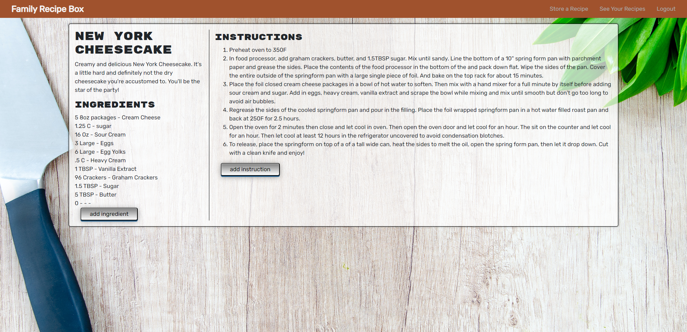
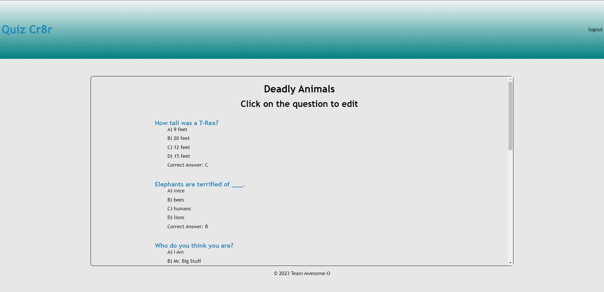
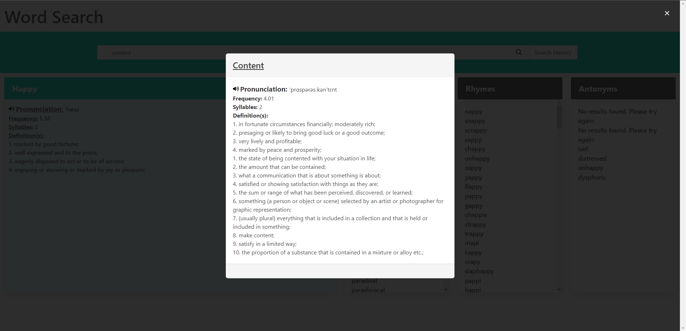

# Hi, I’m Howard, nice to meet you

### Full Stack Developer, Software Engineer

- I completed the Rutgers Full Stack Coding Bootcamp with the highest grade in the class. 
- I also graduated with a BA from Rowan University in Mathematics.
- I am a certified tax assessor and I also have a certificate in secondary education.
- I am continuing to develop more skills as a coder and I'm always working on personal projects.
- I am open to collaborate with other coders on projects as well.
  

# Languages and Tools:
 
 
 
 

    

# Project Demos

      

# Connect with me:
[][Portfolio]
[][LinkedIn]
[][Email]

[LinkedIn]: https://www.linkedin.com/in/howard-van-salisbury-5a547998/
[Portfolio]: https://hvansalisbury.github.io/Howards-Portfolio/
[Email]: mailto:vansal51@yahoo.com
